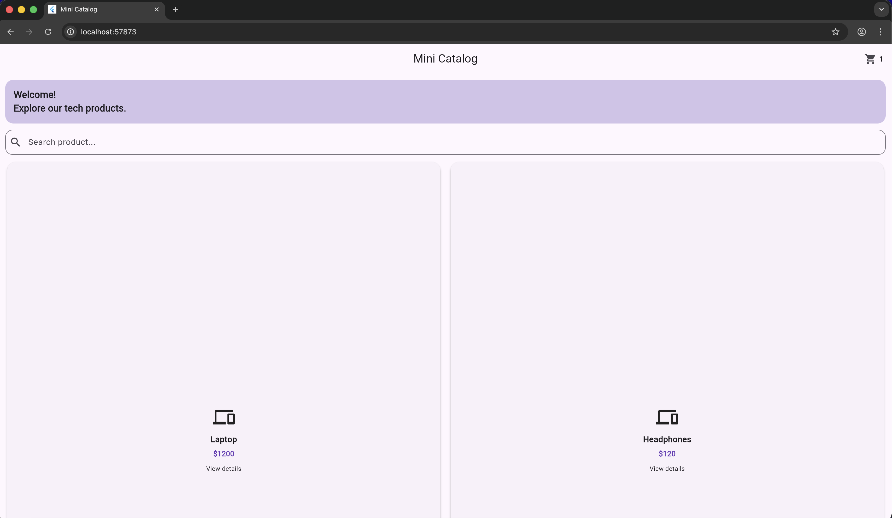
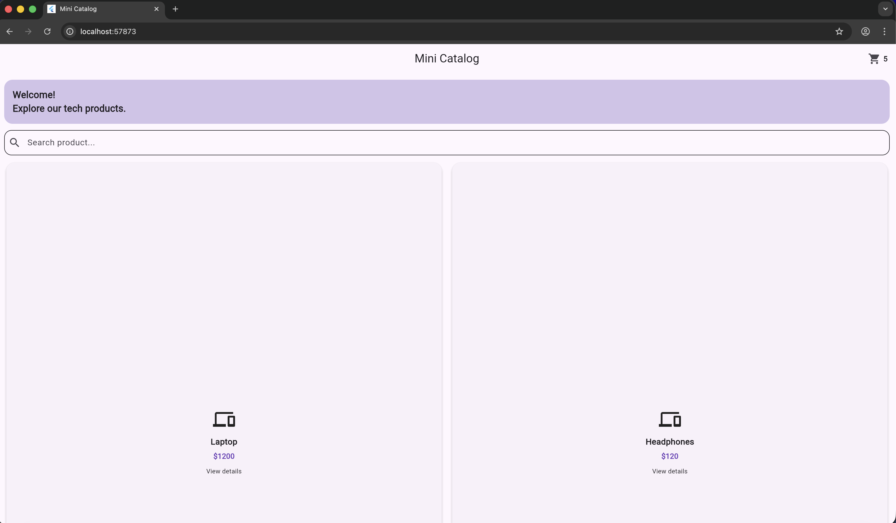

# Mini Catalog Flutter App

This project is a simple Flutter mobile application developed during my **Software Development Internship at Software Persona** as part of a Flutter training program.

The application demonstrates fundamental Flutter concepts including UI layout, product listing using GridView, page navigation, search functionality, and basic state management.

## Features

- Product catalog displayed using GridView
- Product detail page
- Page navigation using Navigator
- Search functionality
- Simple cart simulation
- Clean Material UI design

## Technologies Used

- Flutter
- Dart
- Material UI Widgets

## Flutter Version

Flutter 3.41.4

## How to Run

1. Clone the repository

```bash
git clone https://github.com/altugyamak/mini-catalog-flutter.git
```

2. Go to the project directory

```bash
cd mini-catalog-flutter
```

3. Install dependencies

```bash
flutter pub get
```

4. Run the application

```bash
flutter run
```

## Screenshots

### Home Page


### Product Detail Page


### Add to Cart


## Project Purpose

This project was created as part of a Flutter training program to practice building a simple catalog-style mobile application. It focuses on understanding Flutter’s widget structure, navigation system, UI design, and basic state updates.